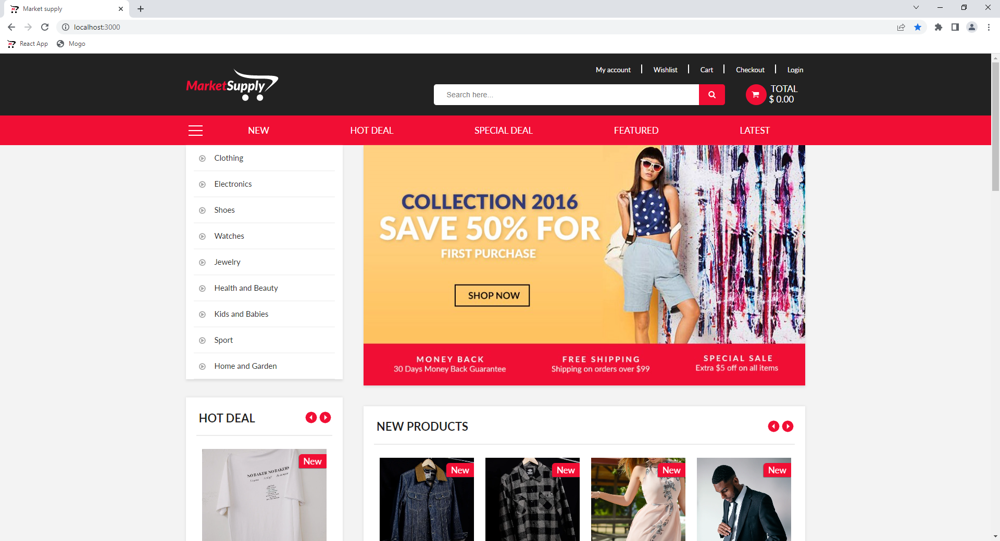
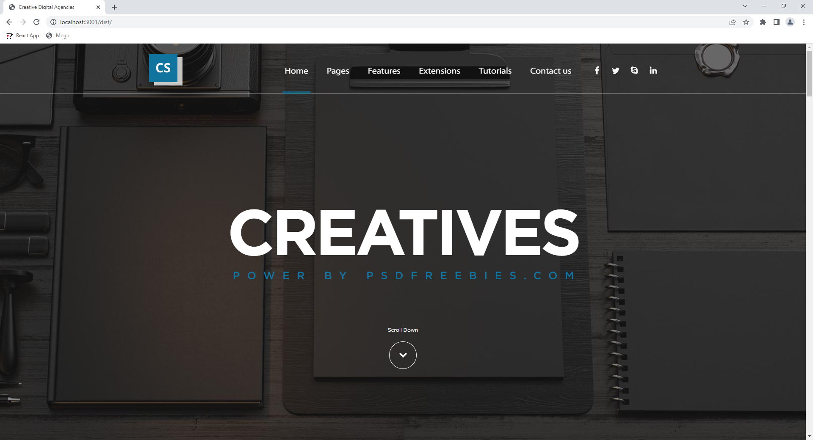
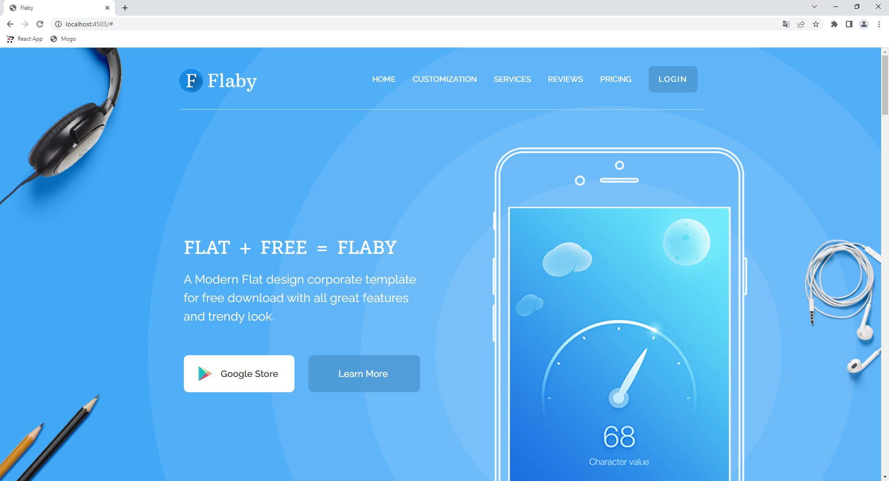
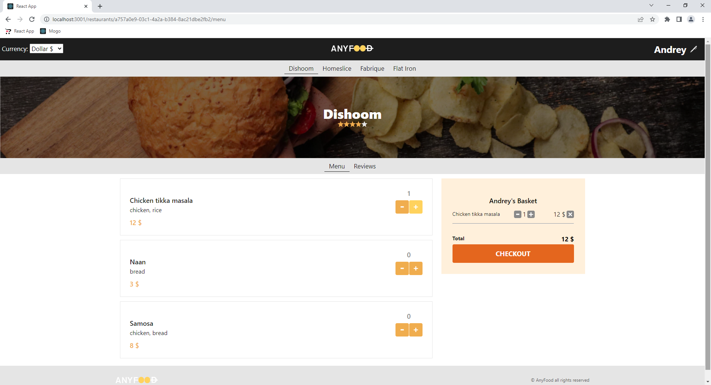

# Portfolio RU :ru:

## MarketSupply

__Описание:__ Универсальный интернет-магазин

__Развернутый проект:__ http://market-supply.alexander-portfolio-and-cv.com

__Исходный код:__ https://github.com/alexReactDev/market-supply

__Использованные технологии:__

- Typescript
- React
- Redux toolkit
- Redux thunk
- React router
- Formik
- SCSS модули
- React slick
- Axios
- Node.js
- Express
- JWT
- Bcrypt
- PostgreSQL

 

__О проекте:__ MarketSupply - это универсальный интернет-магазин где вы можете заказать все, от одежды до последней версии Iphone. В приложении есть поиск и возможность добавлять товары в список желаемого. Зарегистрированные пользователи имеют доступ к личному кабинету где отображаются сделанные ранее заказы, а так же к функции автозаполнения данных при оставлении заказа или отзыва (используются данные профиля). Приложение написано с использованием PERN стека технологий, клиентского роутинга и стейт-менеджера redux. Интерфейс создан с использованием адаптивно-отзывчивой верстки, препроцессора SCSS и методологии БЭМ.

 

## Creative digital agency

__Описание:__ Корпоративный лендинг 

__Развернутый проект:__ http://creative.alexander-portfolio-and-cv.com

__Исходный код:__ https://github.com/alexReactDev/creative-digital-agency

__Использованные технологии:__

- SCSS
- БЭМ
- Kit (Turf)

 

__О проекте:__ Creative digital agency - это корпоративный сайт творческой студии. Сайт раскрывает преимущества компании и позволяет связаться с владельцами. Благодаря адпативно-отзывчивой верстке сайт хорошо смотрится на всех устройства. При верстке применялись препроцессоры SCSS, HTML Kit а так же методология БЭМ.

 

## Flaby

__Описание:__ Адаптивный лендинг

__Развернутый проект:__ http://flaby.alexander-portfolio-and-cv.com

__Исходный код:__ https://github.com/alexReactDev/Flaby

__Использованные технологии:__

- SCSS
- БЭМ
- Адаптивно-отзывчивый дизайн

 

__О проекте:__ Flaby - это легкий адаптивный лединг, рассказывающий о преимуществах продукта и предоставляющий форму для подписки. Благодаря адаптивно-отзывчивой верстке, сайт хорошо выглядит на всех типах устройств. При разработке применялись препроцессор SASS и методология БЭМ.

 

# AnyFood

__Описание:__ Веб-приложение для заказа еды

__Развернутый проект:__ http://anyfood.alexander-portfolio-and-cv.com

__Исходный код:__ https://github.com/alexReactDev/anyfood

__Использованные технологии:__

- React
- Redux
- Redux thunk
- Immer
- Connected React Router
- Jest
- Enzyme
- Proptypes
- Reselect

 

__О проекте:__ AnyFood - это приложение для заказа еды онлайн. На сайте доступно несколько ресторанов, есть возможность выбрать удобную вам валюту, а наличие отзывов и пользовательского рейтинга помогут не ошибиться с выбором. Приложение разработано с использованием стека React/Redux. Так же в приложении используется клиентский роутинг что делает переключение между страницами практически мгновенным. Для тестирования на этапе разработки применялись библиотеки JEST, Enzyme и PropTypes, что обеспечивает высокую надежность приложения.

Примечание: Это учебный проект, написанный в рамках прохождения курса по React на сайте [learn.javascript.ru](learn.javascript.ru).

